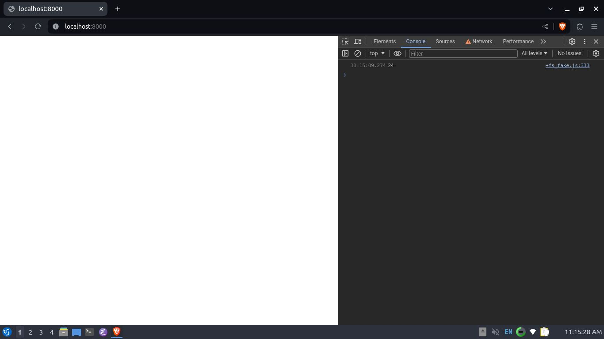

### DEPS
```bash
opam install -y js_of_ocaml-compiler
```
### RUN
```bash
$ node _build/default/main.bc.js    #atau bisa juga: dune exec ./main.bc-for-jsoo
1
$ node _build/default/main.bc.js 4  #atau bisa juga: dune exec ./main.bc-for-jsoo 4
24
$ node _build/default/main.bc.js 10 #atau bisa juga: dune exec ./main.bc-for-jsoo 10
3628800
```  
Itu kan Node! Bagaimana dengan browser? `hapus kode yang ngecall argv, tambah 1 line print_endline (ini anggap sebagai console.log aja dulu :v) dan panggil function fact dengan argumen 4`, seperti ini:
```ocaml
let fact n =
  let rec aux acc n =
    match n with
      0 | 1 -> acc
    | _ -> aux (acc * n) (n - 1)
  in aux 1 n;;
  
print_endline (Int.to_string (fact 4))
```  
tapi kenapa `argv` harus dihapus? (untuk dijawab sendirian :v)
### BUILD
```bash
dune build
```  
`index.html` sudah ada; running di browser, please: `python -m http.server`, visit: `http:localhost:8000`, buka `Developer tools`, see? :v
<p align='center'>
  
</p>

### REFERENCES
- [https://github.com/ocaml/ocaml/](https://github.com/ocaml/ocaml/)  
- [https://github.com/ocaml/dune/](https://github.com/ocaml/dune/)  
- [https://github.com/ocsigen/js_of_ocaml/](https://github.com/ocsigen/js_of_ocaml/)  
